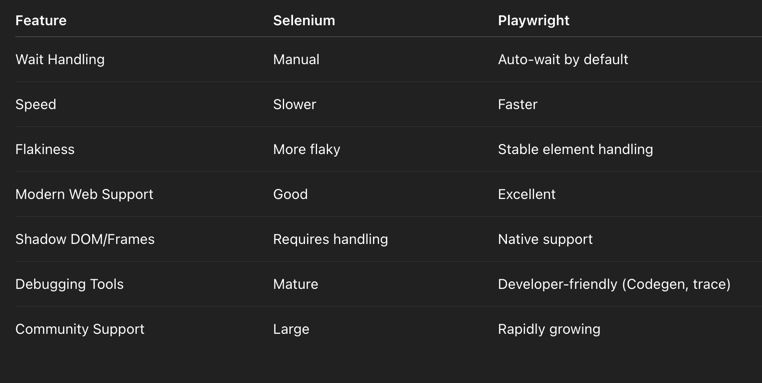

# 🚀 Selenium vs Playwright : Which one to use || Automation Framework (Java + TestNG)

## 📌 Overview

This project is a side-by-side comparison of **Selenium** and **Playwright** frameworks using **Java** and **TestNG**. It demonstrates automation testing of the same test cases using both tools to help evaluate which is better suited for your application.

### ✅ Features:
- ✅ Page Object Model (POM) Structure
- ✅ ExtentReports integration
- ✅ Modular utilities for both Selenium & Playwright
- ✅ `config.properties`-based configuration (excluded from Git)
- ✅ Soft Assertions and continued execution after failures

---

## 📁 Project Structure

````plaintext
test/
├── base/
│   ├── SeleniumBaseTest.java
│   └── PlaywrightBaseTest.java
├── pages/
│   ├── selenium/
│   │   └── ProfitCalculatorPage.java
│   └── playwright/
│       └── ProfitCalculatorPage.java
├── utils/
│   ├── ConfigReader.java
│   ├── ExtentManager.java
│   └── Constants.java
├── tests/
│   ├── SeleniumProfitCalculatorTest.java
│   └── PlaywrightProfitCalculatorTest.java
resources/
├── config.properties
testng.xml


---

## 🧰 Prerequisites

Make sure the following tools are installed on your machine:

| Tool            | Version (Recommended) | Notes                             |
|-----------------|------------------------|------------------------------------|
| Java JDK        | 11 or higher           | Required for both frameworks       |
| IntelliJ IDEA   | Latest                 | IDE for running and debugging      |
| Gradle or Maven | Gradle 7+ or Maven 3+  | Build tool                         |
| Node.js         | 18+                    | Required for Playwright CLI tools  |
| Git             | Latest                 | Version control                    |

---

## 🔧 Setup Instructions

### 1. 🔁 Clone the Repository

```bash
git clone https://github.com/your-username/your-repo-name.git
cd your-repo-name

2. 🔑 Create config.properties
This file is required but not committed for security reasons.

📄 Path: resources/config.properties

🛠️ Sample content:
baseUrl=https://app.fundednext.com/login
username=your-username
password=your-password

▶️ Run the Tests
✅ In IntelliJ:
Right-click testng.xml or any test class

Click Run

📊 Reporting
After test execution, an HTML report will be available at:

/test-output/ExtentReports/ExtentReport.html
Open the file in a browser to view a detailed test execution report.

🔍 Selenium vs Playwright Comparison Highlights



🧑‍💻 Contributing
If you'd like to contribute or improve this framework:

Fork the repo

Create a new branch

Make your changes

Submit a PR

🛡️ Security & Credentials
config.properties is excluded via .gitignore

Never commit sensitive information to version control

Share sample or encrypted configuration formats when collaborating

📬 Contact
For suggestions or collaboration, feel free to raise an issue or PR on the GitHub repository.

👨‍💻 Contributors
   Ali Ahsan


